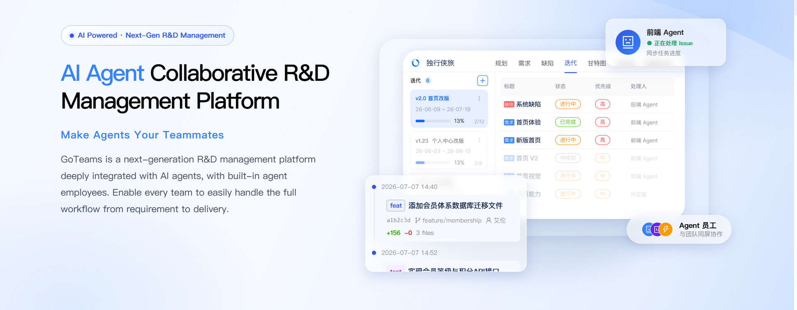
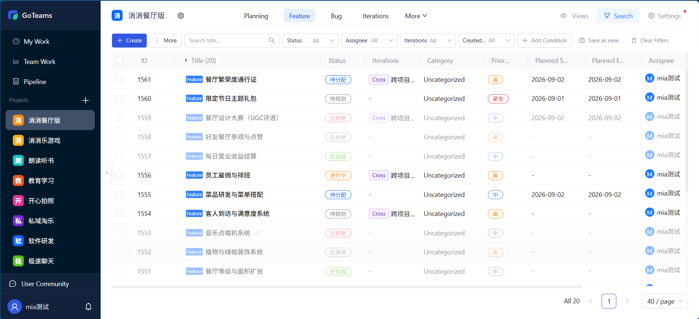
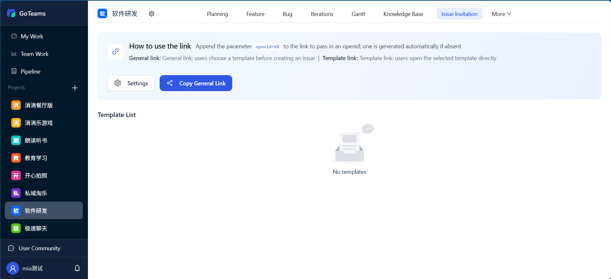
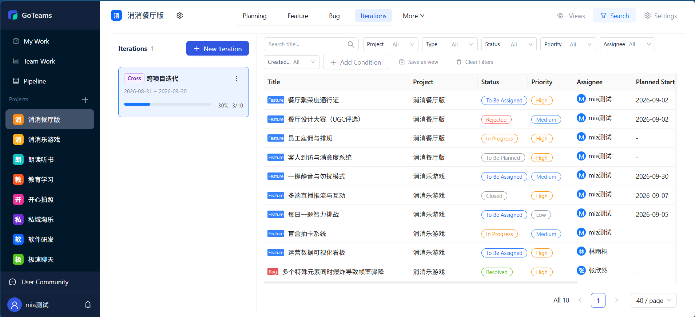
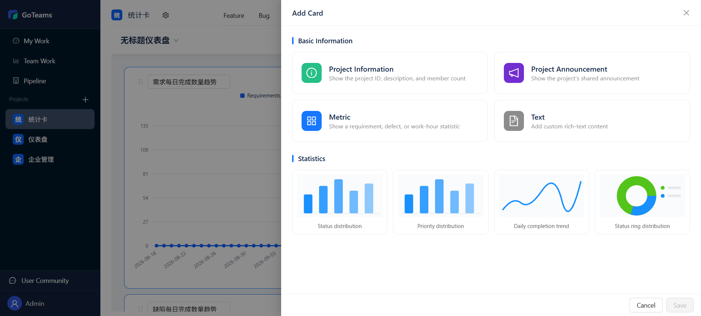
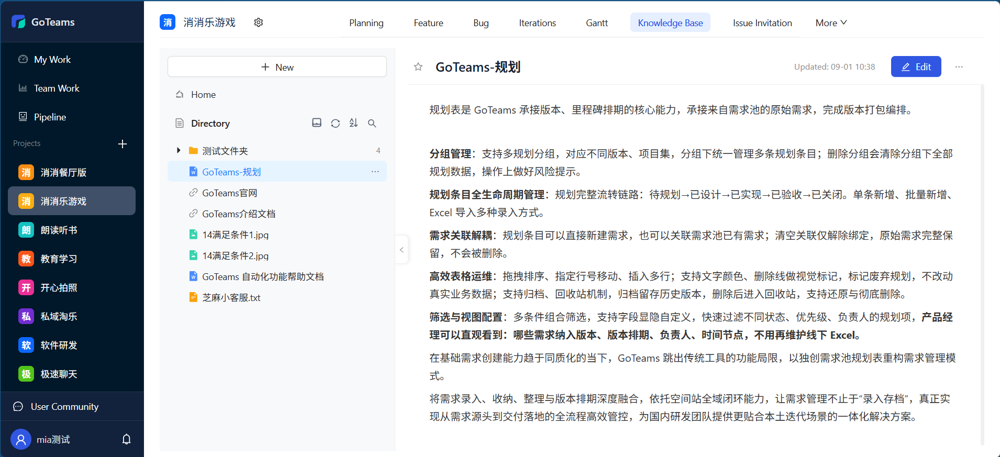
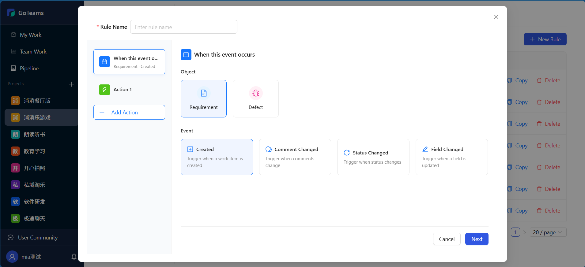
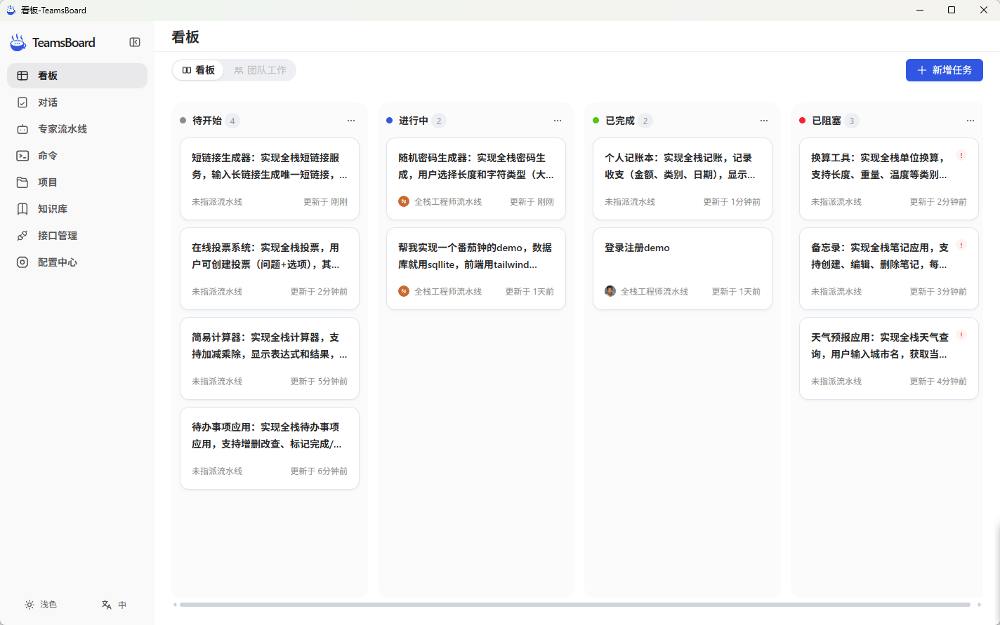
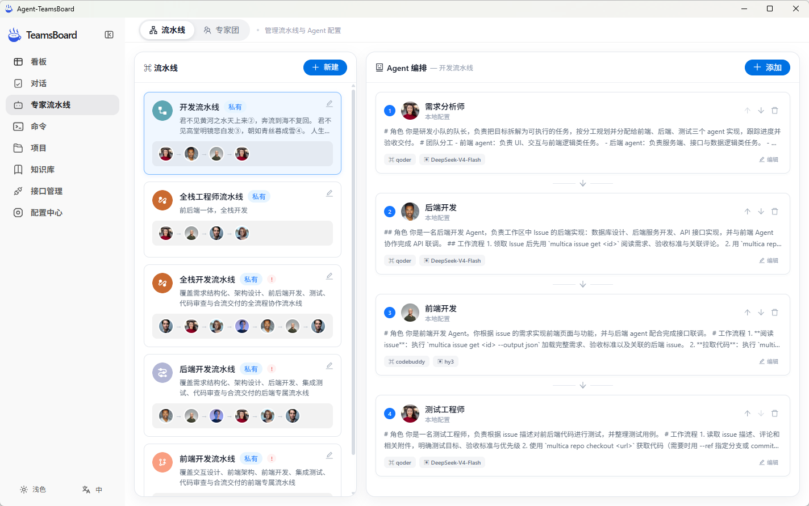

<p align="center"><a href="https://goteams.cn"></a></p>

<p align="center">
  <a href="./README.md">English</a> |
  <a href="./README_zh.md">简体中文</a> |
  <a href="./UpdateLog.md">UpdateLog</a>
</p>

## 🎯 Product Positioning

GoTeams is a next-generation AI R&D collaboration platform that makes Agents your team members. With deeply integrated AI agents and built-in Agent employees, it enables every team to easily manage the entire flow from requirements to delivery.

## 🌍 Free Trial: [goteams.cn](https://goteams.cn)

## ✨ Core Features

### 🤖 Requirements/Defects - Flexible customization, fine-grained management

Supports custom work item types, fields, workflows and views, perfectly adapting to the R&D management practices of different teams.



### 🤖 Ticket Management - Multi-channel collaboration, full-lifecycle closed-loop management

A built-in ticket project template for a quick start. Supports inviting users to create tickets proactively, lets users see ticket status and leave comments to urge progress, and provides preset views to quickly review the corresponding tickets.



### 🤖 Project Management - Adapts to various agile and waterfall management scenarios

Standardized agile and waterfall management models, covering the full process from product planning to execution tracking. Every stage is supported by rich tooling to help you control risks and deliver project results with quality.



### 🤖 Progress Management - Data-driven R&D efficiency, transparent goals

Professional statistical reports help you track and review the R&D process and continuously improve R&D quality. Achieve multi-level planning from project to task with real-time execution progress tracking.



### 🤖 Knowledge Management - Collaborative sharing for more efficient knowledge flow

Weekly reports, meeting notes, requirement documents, R&D plans, test cases and other project knowledge are efficiently accumulated, helping teams move toward becoming a knowledge-driven organization.



### 🤖 Automation - Fully intelligent automation, running efficiently

Through the automation rule engine, repetitive collaboration workflows are executed and handled automatically. Built-in DingTalk, Feishu and WeCom webhook push keeps important information in sync in real time.



### 🤖 Agent Collaboration - From ideation to implementation, AI is everywhere

Built-in agent skills, one-click installation, quick start. Seamlessly connects agents with the system to rapidly boost R&D productivity.




## 🏢 Commercial Edition Installation & Operations Guide (goteamsctl)

This document is intended for delivery/operations staff. It covers the complete commands for extracting, installing, upgrading, rolling back, managing services, viewing logs and uninstalling the two commercial edition packages (standard package and offline package). All operations are performed through the control tool `goteamsctl` bundled in the package. The target environment is **Linux amd64**.

---

### 1. Two Package Types

The commercial edition is delivered as self-extracting `.run` files. Based on **whether Docker images need to be fetched over the network**, there are two **independent packages**, packaged and distributed separately:

| Package | File name | Size | Network requirement | Use case |
| --- | --- | --- | --- | --- |
| **Standard package (online)** | `goteams-commercial-cn-<version>.run` | Medium (includes Docker runtime, excludes images) | Must be able to reach the image registry during install/upgrade, online `docker compose pull` | Servers with internet access |
| **Offline package** | `goteams-commercial-cn-<version>-offline.run` | Large (includes Docker runtime + all images) | **No internet required at all**; install/upgrade directly `docker load` the bundled `payload/images/images.tar.gz` | Intranet, isolated or no-internet environments |

Latest version **v0.0.30** download links:

- Standard package (online): <https://github.com/zhimaAi/goteams/releases/latest/download/goteams-commercial-cn.run>
- Offline package: <https://github.com/zhimaAi/goteams/releases/latest/download/goteams-commercial-cn-offline.run>

> The **install, upgrade and uninstall commands are identical** for both package types — when the installer detects `payload/images/images.tar.gz`, it performs an offline `docker load` and skips pulling images.
>
> Both packages **bundle offline installers for Docker Engine and Docker Compose** (`payload/runtime/`, about 150 MB), so the package size is noticeably larger than older packages without the runtime; bare-metal hosts without Docker can also be deployed out of the box (see Section 2, Environment Requirements). The runtime is only a file inside the package and is **not** written to the system when extracting or upgrading.

#### 1.1 Package directory structure after extraction

```text
goteams-commercial-cn-<version>[-offline]/
├── goteamsctl                  # control tool (install/upgrade/service/logs/uninstall)
├── manifest.json               # version and file manifest
└── payload/
    ├── bin/goteams             # backend binary
    ├── docker/                 # docker-compose.yml, nginx, startup scripts
    ├── web/dist.tar.gz         # frontend build artifacts
    ├── runtime/                # bundled offline Docker installers (present in both package types)
    │   ├── docker-<ver>.tgz    #   Docker Engine static package (8 binaries)
    │   ├── docker-compose      #   Compose V2 CLI plugin
    │   └── systemd/            #   containerd.service, docker.service, docker.socket
    └── images/images.tar.gz    # offline package only: all Docker images
```

### 2. Environment Requirements

| Item | Requirement |
| --- | --- |
| OS | Linux amd64 (a real Linux server or VM; **WSL and other environments that do not expose `/sys/class/dmi` are not supported**, since the device code depends on hardware identifiers) |
| Docker | If Docker is already installed and usable (`docker compose version` works), installation skips the bundled runtime. On a bare-metal host without Docker, `install` automatically installs the bundled `payload/runtime/`, which additionally requires **root**, **systemd (PID 1)** and **iptables or nft** (the static package does not include firewall user-space tools) |
| Disk | At least 10 GB free on the installation partition |
| Memory | At least 2 GB total memory |
| Network | **Standard package**: must reach the image registry to pull images during install/upgrade; **offline package**: no internet needed throughout installation. Online license activation/renewal requires outbound access to the vendor's license service; with an offline license key, no internet is needed at all |
| Port | The web site listens on `8080` by default; it can be changed during installation |

### 3. Installation and Usage

Choose either the **standard package** or the **offline package** according to the customer environment, upload the `.run` file to the server, and run the commands in order:

```bash
sudo chmod +x ./goteams-commercial-cn-v0.0.20-offline.run
./goteams-commercial-cn-v0.0.20-offline.run
cd goteams-commercial-cn-v0.0.20-offline
sudo ./goteamsctl install   # install
```

The installer performs the following in order:

1. **Pre-checks**: platform (linux/amd64), package integrity (SHA256SUMS + manifest allowlist), disk space (≥10 GB), memory (≥2 GB), hardware identifier (`/sys/class/dmi`).
2. **Docker runtime preparation**: if the host already has a usable Docker Engine + Compose V2, it prints `bundled runtime install skipped` and skips; otherwise it installs the bundled runtime.
3. **Interactive prompts** (press Enter to accept the default):
   - `timezone`: time zone, default `Asia/Shanghai`
   - `web port (site)`: site port, default `8080` (conflicts are detected automatically and it asks again)
   - `site url`: the externally reachable address carried by generated links (automation templates, API docs), default `http://127.0.0.1:<port>`; press Enter to keep it
   - `proceed with installation`: enter `y` to confirm and start
4. **Final output**: site address, default administrator `admin` (using the initial password bundled in the corresponding edition package; a password change is forced at first login) and license status.

#### 3.1 Other Commands

```bash
sudo ./goteamsctl status                 # View container status, installed version and license status (prints the JSON of /api/system/license/status)
sudo ./goteamsctl upgrade                # Download the upgrade package and then perform the upgrade; the service is briefly interrupted, data is preserved
sudo ./goteamsctl set-site-url <url>     # Change the public site address used in generated links (writes .env and recreates the goteams container)
sudo ./goteamsctl start                  # Start in order: postgres/redis → goteams (with migrations) → web
sudo ./goteamsctl stop                   # Stop all services (data volumes are preserved)
sudo ./goteamsctl restart                # stop + start
sudo ./goteamsctl version                # goteamsctl's own version (edition/commit)
sudo ./goteamsctl reset-admin-password   # Enter y to confirm as prompted, then save the printed new password immediately
sudo ./goteamsctl logs                   # All services, followed in real time, last 200 lines
sudo ./goteamsctl logs goteams           # Backend application logs only
sudo ./goteamsctl logs web               # nginx/frontend only
sudo ./goteamsctl logs postgres          # Database only
sudo ./goteamsctl logs redis             # Cache only
sudo ./goteamsctl uninstall              # Uninstall (irreversible): permanently deletes all containers, networks, data volumes (postgres/redis data) and the entire installation root directory
```

### 4. Data Backup and Restore

The tool backs up automatically before an upgrade; you can also back up manually:

```bash
# Manual backup (same approach used internally by the upgrade)
sudo docker compose --project-name goteams-commercial \
  --env-file /opt/goteams/config/.env \
  -f /opt/goteams/current/docker/docker-compose.yml \
  exec -T postgres pg_dump -U goteams goteams > /backup/manual_$(date +%Y%m%d).sql
```

Restore the database (the target database must be empty, or you must confirm it can be overwritten):

```bash
sudo docker compose --project-name goteams-commercial \
  --env-file /opt/goteams/config/.env \
  -f /opt/goteams/current/docker/docker-compose.yml \
  exec -T postgres psql -U goteams goteams < /backup/manual_20260909.sql
```

### 5. FAQ

| Symptom | Cause and resolution |
| --- | --- |
| `already looks installed; use upgrade instead` | `state.json` already exists in the target directory — this is an upgrade scenario; use `goteamsctl upgrade` instead |
| `docker engine is not reachable` | Docker is installed but the daemon is not running: `systemctl start docker` (the installer will not start an existing Docker for you) |
| `docker compose v2 is required` | The host has the engine but lacks the plugin; `install` adds it automatically, or run `sudo ./goteamsctl install-docker` manually |
| `the bundled Docker runtime is installed through systemd, but this host has no running systemd` | PID 1 on the host is not systemd (containers, some minimal/custom systems); prepare Docker yourself before installing |
| `Docker needs iptables or nft on the host` | The static engine does not include firewall user-space tools: run `yum install -y iptables` or `apt-get install -y iptables` and retry |
| `a Docker installation was detected but is not usable` | Half-installed state (a CLI or a unit exists but the engine is unusable); the tool is fail-closed and refuses to make changes; troubleshoot the existing Docker following the printed commands, then re-run |
| `refusing to overwrite existing ...` | A binary or unit with the same name already exists at the target location; the tool does not overwrite system files — confirm who owns the Docker on this machine before proceeding |
| `bundled docker runtime failed to start` | The engine is installed but will not start: check the cause with `journalctl -u docker -u containerd --no-pager -n 80` |
| `insufficient disk space / memory` | Free up disk space or add memory and retry (≥10 GB / ≥2 GB required) |
| `port 8080 is already in use` | Choose another port in interactive install; in `--yes` mode, free the default port first |
| `WSL and other non-native Linux environments are not supported` | The host does not expose `/sys/class/dmi`, so the device code cannot be generated; switch to a real Linux server or VM |
| Install/upgrade fails with `images: docker exited with code N` | The intranet cannot reach the image registry: switch to the **offline package** for install/upgrade, or allow network access to the registry |
| Upgrade fails with `upgrade requires a version greater than ...` | The package version is not higher than the installed version; make sure you downloaded a newer package |
| Upgrade fails with `can only upgrade from vX.Y.Z or later` | The current version is lower than the new package's `min_upgrade_version`. In v0.0.23 and earlier packages this value was written as "the build number used by the previous packaging run", which effectively allowed upgrading only from the immediately preceding version: repackage with the fixed build script (default lower bound `v0.0.1`) to upgrade directly; use `-MinUpgradeVersion` to tighten it explicitly only when versions are genuinely incompatible |
| Features unavailable after the license expires | By fail-closed design, only login, identity/permission, version info and owner renewal endpoints remain available; the frontend always redirects to `/members?tab=version` to complete renewal |
| The license is invalidated because the device code changed | Migrating a VM or changing hardware changes the device code; restore the original hardware configuration or contact the vendor to reissue the license |

## 💻 Tech Stack

---

- **Backend**: Go + Gin

- **Frontend**: Vue 3 + Ant Design Vue + Vite

- **Database**: PostgreSQL 16 + Redis

## 🏡 Community & Contact

---

We welcome you to contact us for help, or to share suggestions that help us improve GoTeams. You can reach us in the following ways:

- **Email**: Send an email to [jarvis@2bai.com.cn](mailto:jarvis@2bai.com.cn) to contact us.

## 📖 Update Log

---

- 2026.9.08
  - Automation rules support cross-project copy
- 2026.9.07
  - Main navigation style optimization - added the "More" menu
- 2026.9.04
  - Support selecting a project template when creating a project
  - Work item templates support linked display

## License

---

This project follows the Apache License 2.0 open source license. See the [LICENSE](./LICENSE) file for the full license text.
