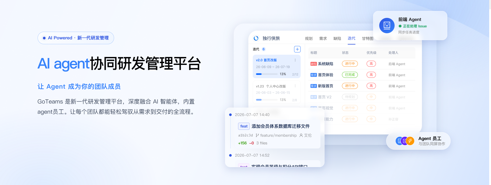
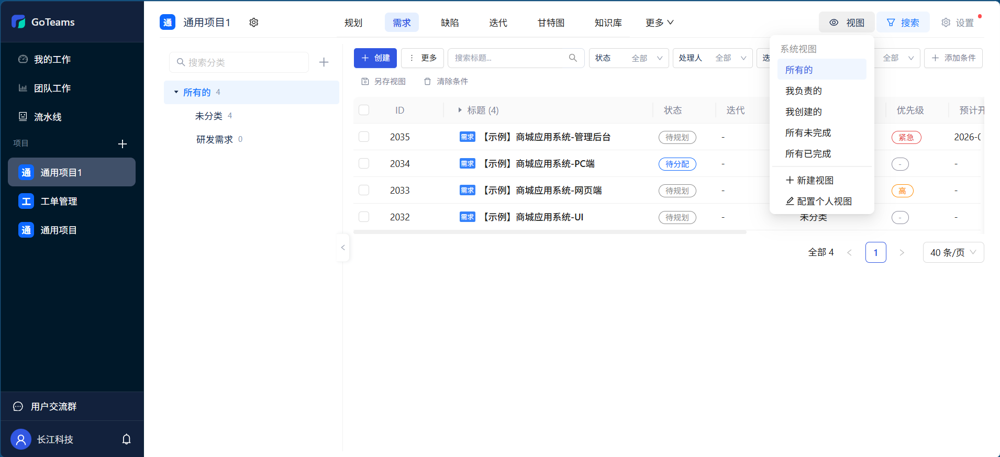
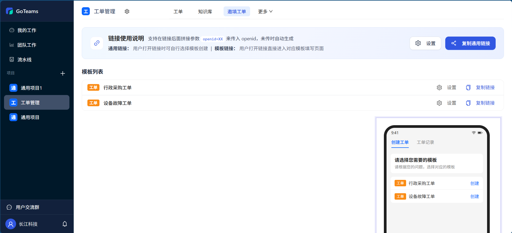
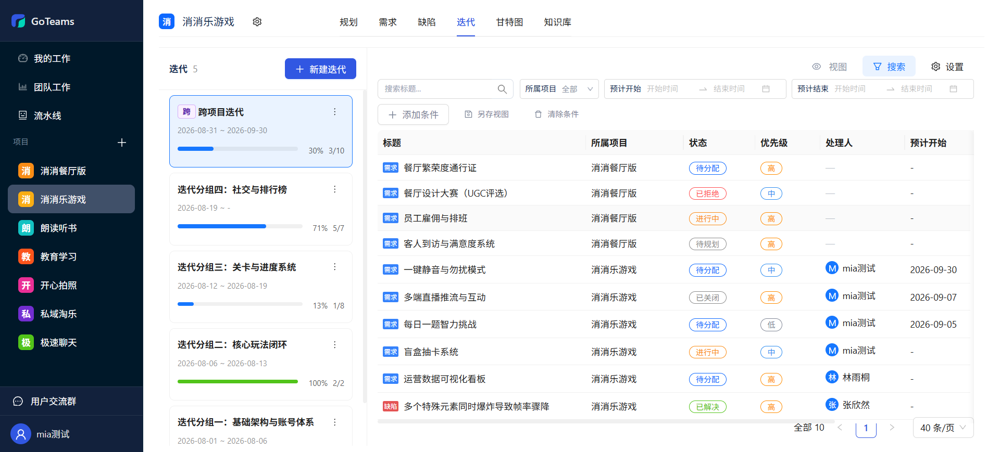
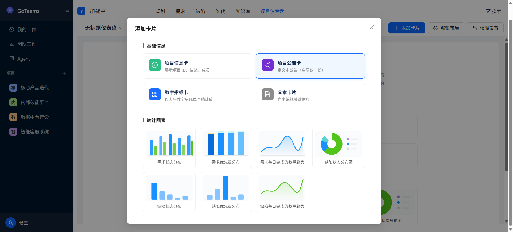
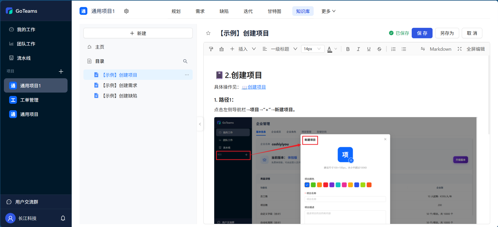
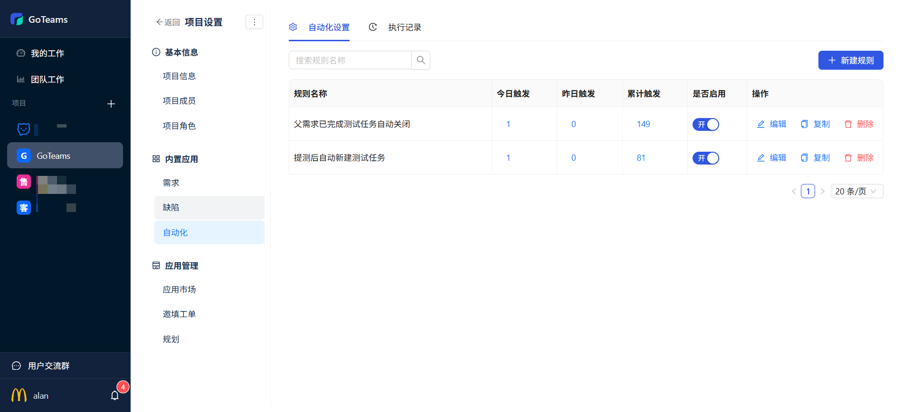
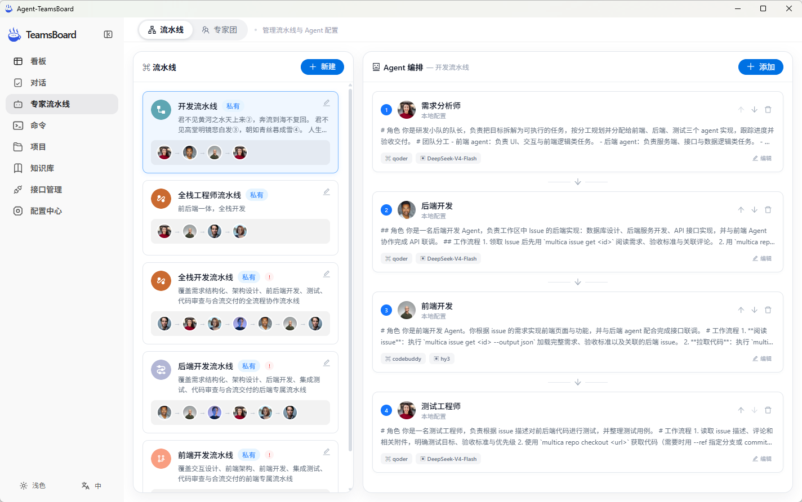

<p align="center"><a href="https://goteams.cn"></a></p>

<p align="center">
  <a href="./README_en.md">English</a> |
  <a href="./README.md">简体中文</a> |
  <a href="./UpdateLog.md">更新日志</a>
</p>

## 🎯 产品定位

GoTeams 是新一代 AI研发协作平台，让 Agent 成为你的团队成员。深度融合 AI 智能体，内置 Agent 员工。让每个团队都能轻松驾驭从需求到交付的全流程。

## 🌍 免费体验网址：[goteams.cn](https://goteams.cn)

## ✨ 核心特性

### 🤖 需求/缺陷 - 灵活定制，精细管理

支持自定义工作项类型、字段、流程、视图，完美适配不同团队的研发管理规范。



### 🤖 工单管理 - 多端协同，全流程闭环管理

内置工单项目模板快速启动。支持邀请用户主动创建工单、用户可见工单状态可在线留言催单、预制各类视图快速查看对应工单



### 🤖 项目管理 - 适配各类敏捷瀑布管理场景

标准化敏捷和瀑布管理模型，从产品规划到执行跟踪的全流程管理，每个环节都有丰富的工具支撑，帮助你把控风险，按质量交付项目成果。



### 🤖 进度管理 - 研发效能数据化、目标透明化

专业的统计报表，帮助你跟踪与复盘研发流程，不断提升研发质量。实现从项目到任务的多层级规划，实时追踪执行进度



### 🤖 知识管理 - 协同共享，让知识流转更高效

周报、会议记录、需求文档、研发方案、测试用例等各类项目知识高效沉淀，帮助团队向知识型组织迈进



### 🤖 自动化流程 - 全流程智能自动化，高效运转

通过自动化规则引擎，让重复性的协作流程自动执行，自动处理。内置钉钉飞书企微 webhook 推送，重要信息实时同步。



### 🤖 Agent 协作 - 从创作到实现，AI 无处不在

内置 agent 技能，一键安装，快速启动。实现 agent 与系统的无缝衔接，快速提升研发生产力。




## 🏢 商业版安装与运维指南（goteamsctl）

本文面向交付/运维人员，说明商业版两种安装包（标准包、离线包）的解压、安装、升级、回滚、服务管理、日志查看与卸载的完整命令。所有操作均通过包内自带的控制工具 `goteamsctl` 完成，目标环境为 **Linux amd64**。

---

### 1. 两种安装包

商业版以自解压 `.run` 文件交付，按**是否需要联网获取 Docker 镜像**分为两类**独立的安装包**，分别打包、分别分发：

| 安装包 | 文件名 | 体积 | 网络要求 | 适用场景 |
| --- | --- | --- | --- | --- |
| **标准包（在线）** | `goteams-commercial-cn-<version>.run` | 中（含 Docker 运行时，不含镜像） | 安装/升级时须能访问镜像仓库，在线 `docker compose pull` | 服务器可上外网 |
| **离线包** | `goteams-commercial-cn-<version>-offline.run` | 大（含 Docker 运行时 + 全部镜像） | **全程无需外网**，安装/升级时直接 `docker load` 包内 `payload/images/images.tar.gz` | 内网、隔离、无外网出口环境 |

最新版本 **v0.0.30** 下载地址：

- 标准包（在线）：<https://github.com/zhimaAi/goteams/releases/latest/download/goteams-commercial-cn.run>
- 离线包：<https://github.com/zhimaAi/goteams/releases/latest/download/goteams-commercial-cn-offline.run>

> 两类包的**安装、升级、卸载命令完全一致**——安装器检测到 `payload/images/images.tar.gz` 存在即走离线 `docker load` 并跳过镜像拉取。
>
> 两类包**都内置 Docker Engine 与 Docker Compose 的离线安装包**（`payload/runtime/`，约 150 MB），因此包体积比不带运行时的旧包明显增大；未安装 Docker 的裸机也能开箱部署（见第 2 节环境要求）。运行时只是包内文件，**不会**因为解压或升级而写入系统。

#### 1.1 解压后的包目录结构

```text
goteams-commercial-cn-<version>[-offline]/
├── goteamsctl                  # 控制工具（安装/升级/服务/日志/卸载）
├── manifest.json               # 版本与文件清单
└── payload/
    ├── bin/goteams             # 后端二进制
    ├── docker/                 # docker-compose.yml、nginx、启动脚本
    ├── web/dist.tar.gz         # 前端编译产物
    ├── runtime/                # 内置 Docker 离线安装包（两类包都有）
    │   ├── docker-<ver>.tgz    #   Docker Engine 静态包（8 个二进制）
    │   ├── docker-compose      #   Compose V2 CLI 插件
    │   └── systemd/            #   containerd.service、docker.service、docker.socket
    └── images/images.tar.gz    # 仅离线包：全部 Docker 镜像
```

### 2. 环境要求

| 项目 | 要求 |
| --- | --- |
| 系统 | Linux amd64（真实 Linux 服务器或虚拟机；**不支持 WSL** 等不暴露 `/sys/class/dmi` 的环境，设备码依赖硬件标识） |
| Docker | 已安装并可用（`docker compose version` 正常）时，安装直接跳过内置运行时；未安装的裸机由 `install` 自动安装包内 `payload/runtime/`，此时额外要求 **root**、**systemd（PID 1）**、**iptables 或 nft**（静态包不含防火墙用户态工具） |
| 磁盘 | 安装分区剩余 ≥ 10 GB |
| 内存 | 总内存 ≥ 2 GB |
| 网络 | **标准包**：安装/升级时须能访问镜像仓库拉取镜像；**离线包**：安装全程无需外网。在线授权激活/续期需出站访问运营方授权服务，使用离线授权 key 则完全不需要外网 |
| 端口 | Web 站点默认监听 `8080`，安装时可修改 |

### 3. 安装与使用

按客户环境选择**标准包**或**离线包**其中一类，把 `.run` 上传到服务器后按顺序执行：

```bash
sudo chmod +x ./goteams-commercial-cn-v0.0.20-offline.run
./goteams-commercial-cn-v0.0.20-offline.run
cd goteams-commercial-cn-v0.0.20-offline
sudo ./goteamsctl install   # 安装
```

安装器依次执行：

1. **预检查**：平台（linux/amd64）、安装包完整性（SHA256SUMS + manifest 白名单）、磁盘空间（≥10 GB）、内存（≥2 GB）、硬件标识（`/sys/class/dmi`）。
2. **Docker 运行时准备**：主机已有可用的 Docker Engine + Compose V2 时打印 `bundled runtime install skipped` 并跳过；否则安装内置运行时。
3. **交互提问**（直接回车接受默认值）：
   - `timezone`：时区，默认 `Asia/Shanghai`
   - `web port (site)`：站点端口，默认 `8080`（自动检测占用并要求重试）
   - `site url`：生成链接（自动化模板、API 文档等）使用的外部访问地址，默认 `http://127.0.0.1:<端口>`，可直接回车沿用
   - `proceed with installation`：输入 `y` 确认开始
4. **完成输出**：站点地址、默认管理员 `admin`（使用对应环境包内置初始密码，首次登录强制修改）、授权状态。

#### 3.1 其他命令

```bash
sudo ./goteamsctl status                 # 查看容器状态、已安装版本与授权状态（输出 /api/system/license/status 的 JSON）
sudo ./goteamsctl upgrade                # 下载升级包后进入执行升级，升级时服务会短暂中断，升级时保留数据
sudo ./goteamsctl set-site-url <url>     # 修改生成链接使用的外部站点地址（写入 .env 并重建 goteams 容器）
sudo ./goteamsctl start                  # 按顺序启动：postgres/redis → goteams（含迁移）→ web
sudo ./goteamsctl stop                   # 停止全部服务（数据卷保留）
sudo ./goteamsctl restart                # stop + start
sudo ./goteamsctl version                # goteamsctl 自身版本（edition/commit）
sudo ./goteamsctl reset-admin-password   # 按提示输入 y 确认，随后立即保存打印出的新密码
sudo ./goteamsctl logs                   # 全部服务，实时跟踪，最近 200 行
sudo ./goteamsctl logs goteams           # 仅后端应用日志
sudo ./goteamsctl logs web               # 仅 nginx/前端
sudo ./goteamsctl logs postgres          # 仅数据库
sudo ./goteamsctl logs redis             # 仅缓存
sudo ./goteamsctl uninstall              # 卸载（不可恢复）：会永久删除全部容器、网络、数据卷（postgres/redis 数据）、整个安装根目录
```

### 4. 数据备份与恢复

升级前工具会自动备份，也可手动备份：

```bash
# 手动备份（与升级内部使用的方式一致）
sudo docker compose --project-name goteams-commercial \
  --env-file /opt/goteams/config/.env \
  -f /opt/goteams/current/docker/docker-compose.yml \
  exec -T postgres pg_dump -U goteams goteams > /backup/manual_$(date +%Y%m%d).sql
```

恢复数据库（目标库需为空或确认可覆盖后执行）：

```bash
sudo docker compose --project-name goteams-commercial \
  --env-file /opt/goteams/config/.env \
  -f /opt/goteams/current/docker/docker-compose.yml \
  exec -T postgres psql -U goteams goteams < /backup/manual_20260909.sql
```

### 5. 常见问题

| 现象 | 原因与处理 |
| --- | --- |
| `already looks installed; use upgrade instead` | 目标目录已存在 `state.json`，是升级场景，改用 `goteamsctl upgrade` |
| `docker engine is not reachable` | Docker 已安装但守护进程未运行：`systemctl start docker`（安装器不会替你启动一个已有的 Docker） |
| `docker compose v2 is required` | 主机有引擎但缺插件；`install` 会自动补齐，手动执行时可 `sudo ./goteamsctl install-docker` |
| `the bundled Docker runtime is installed through systemd, but this host has no running systemd` | 主机 PID 1 不是 systemd（容器、部分极简/定制系统）；请自行准备 Docker 后再安装 |
| `Docker needs iptables or nft on the host` | 静态引擎不含防火墙用户态工具：`yum install -y iptables` 或 `apt-get install -y iptables` 后重试 |
| `a Docker installation was detected but is not usable` | 半安装状态（有 CLI 或有单元但引擎不可用），工具按 fail-closed 设计拒绝改动；按输出的命令排查既有 Docker，修好后重跑 |
| `refusing to overwrite existing ...` | 目标位置已有同名二进制或单元；工具不覆盖系统文件，请确认这台机器的 Docker 归属后处理 |
| `bundled docker runtime failed to start` | 引擎已装但起不来：`journalctl -u docker -u containerd --no-pager -n 80` 查原因 |
| `insufficient disk space / memory` | 清理磁盘或扩容内存后重试（要求 ≥10GB / ≥2GB） |
| `port 8080 is already in use` | 交互安装时换一个端口；`--yes` 模式需先释放默认端口 |
| `WSL and other non-native Linux environments are not supported` | 主机未暴露 `/sys/class/dmi`，无法生成设备码；请更换为真实 Linux 服务器/虚拟机 |
| 安装/升级报 `images: docker exited with code N` | 内网无法访问镜像仓库拉取镜像：改用**离线包**安装/升级，或放通到 registry 的网络 |
| 升级报 `upgrade requires a version greater than ...` | 包版本不高于已安装版本；确认下载了更新的包 |
| 升级报 `can only upgrade from vX.Y.Z or later` | 当前版本低于新包 `min_upgrade_version`。v0.0.23 及更早的包该值被写成「上一次打包占用的构建号」，等于只允许从紧邻版本升级：用修复后的打包脚本重新出包（默认下限 `v0.0.1`）即可直升；确有跨版本不兼容时再用 `-MinUpgradeVersion` 显式收紧 |
| 授权失效后功能不可用 | 属 fail-closed 设计：仅登录、身份/权限、版本信息和 owner 续期接口可用，前端固定进入 `/members?tab=version` 页面完成续期 |
| 设备码变化导致授权失效 | 迁移虚拟机/更换硬件会改变设备码；恢复原硬件配置或联系运营方重新签发授权 |

## 💻 技术栈

---

- **后端**：Go + Gin

- **前端**：Vue 3 + Ant Design Vue + Vite

- **数据库**：PostgreSQL 16 + Redis

## 🏡 社区交流 & 联系我们

---

欢迎联系我们获取帮助，或者提供建议帮助我们改善 GoTeams。您可以通过以下方式联系我们：

- **邮箱**：发送邮件到 [jarvis@2bai.com.cn](mailto:jarvis@2bai.com.cn) 联系我们。

## 📖 更新日志

---

- 2026.9.08
  - 自动化规则支持跨项目复制
- 2026.9.07
  - 主导航的样式优化-增加【更多】菜单
- 2026.9.04
  - 新增项目时支持选择项目模板
  - 工作项模板支持联动显示

## 协议

---

本项目遵循 Apache License 2.0 开源协议，完整的许可证文本请查看 [LICENSE](./LICENSE) 文件。
